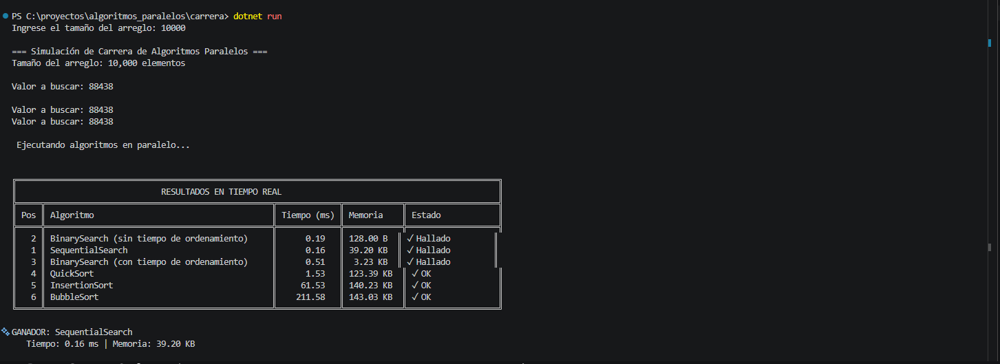

# Algoritmos Paralelos: Proyecto Final - Simulación de Carrera

## 1. Introducción

Los algoritmos paralelos representan una evolución fundamental en el desarrollo de software, permitiendo la ejecución simultánea de múltiples tareas para aprovechar al máximo los recursos computacionales modernos. En un mundo donde los procesadores multinúcleo son el estándar, la capacidad de diseñar e implementar soluciones paralelas se ha convertido en una habilidad esencial para los desarrolladores.

Este proyecto explora la implementación práctica de algoritmos paralelos mediante una simulación de carrera que compara el rendimiento de distintos algoritmos de búsqueda y ordenamiento ejecutándose simultáneamente. La aplicación desarrollada en C# utiliza tareas paralelas (Tasks) para ejecutar múltiples algoritmos sobre el mismo conjunto de datos, midiendo con precisión el tiempo de ejecución y el consumo de memoria de cada uno.

## 2. Descripción del Proyecto

El proyecto consiste en una aplicación de consola desarrollada en C# que simula una "carrera" entre diferentes algoritmos de búsqueda y ordenamiento. La aplicación:

- Genera un arreglo de números enteros aleatorios del tamaño especificado por el usuario
- Ejecuta simultáneamente 6 algoritmos diferentes:
  - 3 algoritmos de ordenamiento (BubbleSort, QuickSort, InsertionSort)
  - 3 variantes de búsqueda (SequentialSearch, BinarySearch con ordenamiento previo, BinarySearch sobre arreglo pre-ordenado)
- Cada algoritmo trabaja sobre una copia independiente del arreglo original
- Mide con precisión el tiempo de ejecución de cada algoritmo usando `Stopwatch`
- Calcula el consumo de memoria individual mediante `GC.GetTotalAllocatedBytes`
- Presenta los resultados en tiempo real en una tabla formateada
- Determina el algoritmo "ganador" basándose en el tiempo de ejecución

La aplicación está diseñada para demostrar las diferencias de rendimiento entre algoritmos con diferentes complejidades temporales (O(n²), O(n log n), O(log n), O(n)) y cómo se comportan al ejecutarse en paralelo.

## 3. Objetivos

### a. Objetivo General

Desarrollar una aplicación que implemente y compare el rendimiento de múltiples algoritmos de búsqueda y ordenamiento ejecutándose en paralelo, permitiendo analizar sus características de tiempo de ejecución y consumo de recursos en un entorno concurrente.

### b. Objetivos Específicos

1. Implementar correctamente los algoritmos de ordenamiento BubbleSort, QuickSort e InsertionSort
2. Implementar los algoritmos de búsqueda secuencial y binaria
3. Utilizar el modelo de programación paralela basado en tareas (Task Parallel Library) de .NET
4. Medir con precisión el tiempo de ejecución de cada algoritmo mediante herramientas de diagnóstico
5. Calcular el consumo de memoria individual de cada algoritmo
6. Presentar los resultados de forma visual y comprensible mediante tablas formateadas
7. Analizar y comparar el rendimiento de algoritmos con diferentes complejidades algorítmicas
8. Demostrar la correcta sincronización y gestión de recursos compartidos en un entorno paralelo

## 4. Definición de Algoritmos Paralelos

Los algoritmos paralelos son secuencias de instrucciones diseñadas para ejecutarse simultáneamente en múltiples unidades de procesamiento con el objetivo de resolver un problema de manera más eficiente que su contraparte secuencial. A diferencia de los algoritmos tradicionales que ejecutan una instrucción tras otra en un solo procesador, los algoritmos paralelos dividen el problema en subtareas que pueden procesarse concurrentemente.

**Características principales:**

- **Concurrencia**: Múltiples operaciones ocurren al mismo tiempo
- **Descomposición**: El problema se divide en partes independientes
- **Comunicación**: Las unidades de procesamiento intercambian información cuando es necesario
- **Sincronización**: Se coordinan las tareas para mantener la coherencia de datos
- **Escalabilidad**: El rendimiento mejora al agregar más recursos de procesamiento

**Ventajas:**
- Reducción del tiempo de ejecución
- Mejor aprovechamiento de hardware moderno (CPUs multinúcleo)
- Mayor throughput en sistemas que procesan múltiples tareas

**Desafíos:**
- Complejidad en el diseño y debugging
- Overhead de sincronización y comunicación
- Condiciones de carrera y problemas de concurrencia
- No todos los problemas son paralelizables (Ley de Amdahl)

## 5. Etapas de los Algoritmos Paralelos

### a. Partición

La partición es el proceso de dividir el problema en tareas pequeñas que puedan ejecutarse concurrentemente. Esta etapa es fundamental ya que determina el nivel de paralelismo alcanzable.

**En nuestro proyecto:**
- Cada algoritmo (BubbleSort, QuickSort, etc.) se ejecuta como una tarea independiente
- Cada tarea recibe una copia del arreglo para trabajar de forma aislada
- La partición es a nivel de algoritmo completo 

**Tipos de partición:**
- **Partición de datos**: Dividir los datos entre procesadores
- **Partición funcional**: Dividir las operaciones entre procesadores 

### b. Comunicación

La comunicación se refiere al intercambio de información entre tareas paralelas. Puede ser necesaria cuando las tareas dependen de resultados de otras tareas.

**En nuestro proyecto:**
- Comunicación mínima: cada algoritmo trabaja independientemente
- Se utiliza `ConcurrentBag<AlgorithmResult>` para recolectar resultados de forma thread-safe
- Un objeto `lock` sincroniza el acceso a recursos compartidos (contador de progreso, consola)
- No hay dependencias entre algoritmos, minimizando overhead

**Patrones de comunicación:**
- **Punto a punto**: Comunicación directa entre dos tareas
- **Colectiva**: Una tarea comunica con múltiples tareas
- **Sin comunicación**: Ideal cuando las tareas son completamente independientes 

### c. Agrupamiento

El agrupamiento combina tareas pequeñas en tareas más grandes para reducir el overhead de comunicación y administración. El objetivo es encontrar un balance entre paralelismo y eficiencia.

**En nuestro proyecto:**
- Cada algoritmo completo se trata como una sola tarea
- No se subdividen los algoritmos individuales (aunque QuickSort internamente usa recursión)
- El agrupamiento está a nivel de "algoritmo completo"
- Esto reduce la complejidad de sincronización y comunicación

**Consideraciones:**
- Tareas muy pequeñas: mucho overhead de gestión
- Tareas muy grandes: poco paralelismo aprovechado
- Nuestro enfoque: balance entre 6 tareas de complejidad media-alta

### d. Asignación

La asignación determina qué procesador ejecutará cada tarea. En sistemas modernos, esto suele ser manejado automáticamente por el sistema operativo y el runtime.

**En nuestro proyecto:**
- La asignación es manejada por el Task Scheduler de .NET
- `Task.Run()` crea tareas que el scheduler asigna a threads del thread pool
- El sistema operativo distribuye estos threads entre cores físicos
- Es una asignación dinámica: las tareas se reasignan según disponibilidad

**Estrategias de asignación:**
- **Estática**: Asignación fija antes de la ejecución
- **Dinámica**: Asignación durante la ejecución basada en carga 
- **Load balancing**: Distribuir carga equitativamente entre procesadores

## 6. Técnicas Algorítmicas Paralelas

Las técnicas algorítmicas paralelas son estrategias de diseño que permiten aprovechar el paralelismo de manera efectiva:

### Divide y Vencerás Paralelo
Dividir el problema recursivamente en subproblemas independientes que se resuelven en paralelo.
- **Ejemplo en proyecto**: QuickSort puede paralelizarse dividiendo particiones
- **Ventaja**: Escalabilidad natural con más cores

### Paralelismo de Tareas (Task Parallelism)
Ejecutar diferentes tareas/funciones simultáneamente.
- **Usado en proyecto**: Cada algoritmo es una tarea diferente ejecutándose en paralelo
- **Framework**: Task Parallel Library (TPL) de .NET

### Paralelismo de Datos (Data Parallelism)
Aplicar la misma operación sobre diferentes elementos de datos simultáneamente.
- **Potencial uso**: Podría paralelizar búsquedas en diferentes secciones del arreglo
- **No implementado**: Cada algoritmo procesa su copia completa secuencialmente

### Pipeline Paralelo
Dividir el procesamiento en etapas donde cada etapa procesa diferentes datos simultáneamente.
- **No aplicable**: Nuestros algoritmos no tienen etapas secuenciales interdependientes

### Master-Worker Pattern
Un proceso maestro distribuye trabajo a procesos workers.
- **Implementación parcial**: El main thread coordina, los Tasks son workers

## 7. Modelos de Algoritmos Paralelos

### Modelo PRAM (Parallel Random Access Machine)
Modelo teórico con procesadores que acceden a memoria compartida.
- **Relación con proyecto**: Nuestra arquitectura usa memoria compartida (ConcurrentBag, variables compartidas)

### Modelo BSP (Bulk Synchronous Parallel)
Ejecución en supersteps con sincronización entre cada paso.
- **Relación**: La espera con `Task.WaitAll()` es una barrera de sincronización

### Modelo de Paso de Mensajes (Message Passing)
Procesos se comunican mediante mensajes explícitos.
- **No usado**: Preferimos memoria compartida para simplicidad

### Modelo de Tareas (Task-Based Model)
Descomposición en tareas con dependencias.
- **Usado en proyecto**: Task Parallel Library implementa este modelo
- **Ventaja**: Abstracción de alto nivel, manejo automático de threads

### Modelo Fork-Join
Bifurcación de tareas que luego se sincronizan.
- **Usado en proyecto**: 
  - Fork: `Task.Run()` para cada algoritmo
  - Join: `Task.WaitAll()` espera a todas las tareas

## 8. Algoritmos de Búsquedas y Ordenamiento

### a. Búsqueda Secuencial

**Descripción**: Recorre el arreglo elemento por elemento hasta encontrar el valor buscado o llegar al final.

**Complejidad Temporal**: O(n)

**Pseudocódigo**:
```
FUNCIÓN BúsquedaSecuencial(arreglo[], valor)
    PARA i DESDE 0 HASTA longitud(arreglo) - 1
        SI arreglo[i] == valor ENTONCES
            RETORNAR i
        FIN SI
    FIN PARA
    RETORNAR -1  // No encontrado
FIN FUNCIÓN
```

**Código C#**:
```csharp
static int SequentialSearch(int[] arr, int value)
{
    for (int i = 0; i < arr.Length; i++) 
        if (arr[i] == value) 
            return i;
    return -1;
}
```

**Características**:
- No requiere que el arreglo esté ordenado
- Simple de implementar
- Ineficiente para arreglos grandes
- Mejor caso: O(1), Peor caso: O(n)

---

### b. Búsqueda Binaria

**Descripción**: Divide repetidamente el arreglo ordenado por la mitad, descartando la mitad que no puede contener el valor buscado.

**Complejidad Temporal**: O(log n)

**Requisito**: El arreglo debe estar ordenado

**Pseudocódigo**:
```
FUNCIÓN BúsquedaBinaria(arreglo[], valor)
    inicio ← 0
    fin ← longitud(arreglo) - 1
    
    MIENTRAS inicio <= fin HACER
        medio ← inicio + (fin - inicio) / 2
        
        SI arreglo[medio] == valor ENTONCES
            RETORNAR medio
        SINO SI arreglo[medio] < valor ENTONCES
            inicio ← medio + 1
        SINO
            fin ← medio - 1
        FIN SI
    FIN MIENTRAS
    
    RETORNAR -1  // No encontrado
FIN FUNCIÓN
```

**Código C#**:
```csharp
static int BinarySearch(int[] arr, int value)
{
    int lo = 0, hi = arr.Length - 1;
    while (lo <= hi)
    {
        int mid = lo + ((hi - lo) >> 1);
        if (arr[mid] == value) return mid;
        if (arr[mid] < value) lo = mid + 1; 
        else hi = mid - 1;
    }
    return -1;
}
```

**Características**:
- Muy eficiente para arreglos grandes
- Requiere arreglo ordenado (costo adicional si no lo está)
- Divide el espacio de búsqueda a la mitad en cada iteración
- En el proyecto se implementan 2 versiones:
  - Con tiempo de ordenamiento (incluye `Array.Sort`)
  - Sin tiempo de ordenamiento (sobre arreglo pre-ordenado)

---

### c. Algoritmo de Ordenamiento de la Burbuja (Bubble Sort)

**Descripción**: Compara pares adyacentes y los intercambia si están en el orden incorrecto, repitiendo hasta que el arreglo esté ordenado.

**Complejidad Temporal**: O(n²)

**Pseudocódigo**:
```
FUNCIÓN BubbleSort(arreglo[])
    n ← longitud(arreglo)
    
    PARA i DESDE 0 HASTA n-2 HACER
        intercambió ← FALSO
        
        PARA j DESDE 0 HASTA n-i-2 HACER
            SI arreglo[j] > arreglo[j+1] ENTONCES
                Intercambiar(arreglo[j], arreglo[j+1])
                intercambió ← VERDADERO
            FIN SI
        FIN PARA
        
        SI NO intercambió ENTONCES
            ROMPER  // Ya está ordenado
        FIN SI
    FIN PARA
FIN FUNCIÓN
```

**Código C#**:
```csharp
static void BubbleSort(int[] arr)
{
    int n = arr.Length;
    bool swapped;
    for (int i = 0; i < n - 1; i++)
    {
        swapped = false;
        for (int j = 0; j < n - i - 1; j++)
        {
            if (arr[j] > arr[j + 1])
            {
                int tmp = arr[j]; 
                arr[j] = arr[j + 1]; 
                arr[j + 1] = tmp;
                swapped = true;
            }
        }
        if (!swapped) break;
    }
}
```

**Características**:
- Algoritmo estable (mantiene orden relativo de elementos iguales)
- Simple de implementar
- Muy ineficiente para arreglos grandes
- Mejor caso: O(n) si ya está ordenado
- Peor caso: O(n²)
- Alto consumo de tiempo en comparación con algoritmos modernos

---

### d. Quick Sort

**Descripción**: Algoritmo de divide y vencerás que selecciona un pivote, particiona el arreglo y ordena recursivamente las particiones.

**Complejidad Temporal**: O(n log n) promedio, O(n²) peor caso

**Pseudocódigo**:
```
FUNCIÓN QuickSort(arreglo[], inicio, fin)
    SI inicio < fin ENTONCES
        pivote ← Particionar(arreglo, inicio, fin)
        QuickSort(arreglo, inicio, pivote - 1)
        QuickSort(arreglo, pivote + 1, fin)
    FIN SI
FIN FUNCIÓN

FUNCIÓN Particionar(arreglo[], inicio, fin)
    pivote ← arreglo[fin]
    i ← inicio - 1
    
    PARA j DESDE inicio HASTA fin-1 HACER
        SI arreglo[j] <= pivote ENTONCES
            i ← i + 1
            Intercambiar(arreglo[i], arreglo[j])
        FIN SI
    FIN PARA
    
    Intercambiar(arreglo[i+1], arreglo[fin])
    RETORNAR i + 1
FIN FUNCIÓN
```

**Código C#**:
```csharp
static void QuickSort(int[] arr, int low, int high)
{
    if (low >= high) return;
    int p = Partition(arr, low, high);
    QuickSort(arr, low, p - 1);
    QuickSort(arr, p + 1, high);
}

static int Partition(int[] arr, int low, int high)
{
    int pivot = arr[high];
    int i = low - 1;
    for (int j = low; j < high; j++)
    {
        if (arr[j] <= pivot)
        {
            i++;
            int tmp = arr[i]; 
            arr[i] = arr[j]; 
            arr[j] = tmp;
        }
    }
    int t = arr[i + 1]; 
    arr[i + 1] = arr[high]; 
    arr[high] = t;
    return i + 1;
}
```

**Características**:
- Uno de los algoritmos más rápidos en la práctica
- In-place (no requiere memoria adicional significativa)
- No estable (puede cambiar orden relativo)
- Peor caso raro con buena selección de pivote
- Altamente paralelizable (las particiones son independientes)

---

### e. Método de Inserción (Insertion Sort)

**Descripción**: Construye el arreglo ordenado elemento por elemento, insertando cada nuevo elemento en su posición correcta.

**Complejidad Temporal**: O(n²)

**Pseudocódigo**:
```
FUNCIÓN InsertionSort(arreglo[])
    PARA i DESDE 1 HASTA longitud(arreglo)-1 HACER
        clave ← arreglo[i]
        j ← i - 1
        
        MIENTRAS j >= 0 Y arreglo[j] > clave HACER
            arreglo[j+1] ← arreglo[j]
            j ← j - 1
        FIN MIENTRAS
        
        arreglo[j+1] ← clave
    FIN PARA
FIN FUNCIÓN
```

**Código C#**:
```csharp
static void InsertionSort(int[] arr)
{
    for (int i = 1; i < arr.Length; i++)
    {
        int key = arr[i];
        int j = i - 1;
        while (j >= 0 && arr[j] > key)
        {
            arr[j + 1] = arr[j];
            j--;
        }
        arr[j + 1] = key;
    }
}
```

**Características**:
- Algoritmo estable
- Eficiente para arreglos pequeños o casi ordenados
- Mejor caso: O(n) cuando está casi ordenado
- Peor caso: O(n²) cuando está en orden inverso
- Adaptativo: aprovecha el orden existente
- Usado en algoritmos híbridos (TimSort, IntroSort)

---

## 9. Programa Desarrollado

### a. Explicación de su Funcionamiento

El programa desarrollado implementa una simulación de carrera de algoritmos con las siguientes características:

**Flujo de Ejecución:**

1. **Inicialización**:
   - Solicita al usuario el tamaño del arreglo
   - Genera un arreglo de números enteros aleatorios usando `Random` con semilla fija (42) para reproducibilidad
   - Selecciona un valor aleatorio del arreglo para las búsquedas

2. **Preparación de Tareas**:
   - Crea una copia del arreglo pre-ordenada para la búsqueda binaria sin costo de ordenamiento
   - Inicializa estructuras thread-safe (`ConcurrentBag`, objetos de sincronización)
   - Prepara 6 tareas paralelas usando `Task.Run()`

3. **Ejecución Paralela**:
   - Cada tarea ejecuta un algoritmo sobre su propia copia del arreglo
   - Mide tiempo con `Stopwatch` de alta precisión
   - Mide memoria con `GC.GetTotalAllocatedBytes(true)`
   - Al terminar, actualiza la tabla en tiempo real de forma sincronizada

4. **Presentación de Resultados**:
   - Muestra tabla formateada con resultados ordenados por tiempo
   - Incluye posición, nombre del algoritmo, tiempo en ms, memoria consumida y estado
   - Identifica y destaca el algoritmo ganador
   - Sale automáticamente sin esperar input del usuario

**Características Técnicas**:

- **Lenguaje**: C# (.NET 10)
- **Paralelismo**: Task Parallel Library (TPL)
- **Sincronización**: `lock` para acceso seguro a recursos compartidos
- **Medición de tiempo**: `System.Diagnostics.Stopwatch`
- **Medición de memoria**: `GC.GetTotalAllocatedBytes`
- **Colección thread-safe**: `ConcurrentBag<AlgorithmResult>`

**Estructura del Código**:
```
Program.cs
├── Main() - Punto de entrada, orquestación
├── RunSort() - Ejecuta algoritmos de ordenamiento
├── RunSearch() - Ejecuta algoritmos de búsqueda
├── RunSearchWithPreSort() - Búsqueda binaria con ordenamiento
├── UpdateProgressAndTable() - Actualización sincronizada de resultados
├── GetShortMessage() - Formato de mensajes
├── TruncateOrPad() - Ajuste de strings
├── FormatBytes() - Formato de bytes
├── AlgorithmResult - Clase para resultados
└── Algoritmos implementados (BubbleSort, QuickSort, etc.)
```

---

### b. Fotos de la Aplicación



---

### c. Link de Github 

>
> 
> **Repositorio de GitHub**:
> ```
> https://github.com/Nexopower/carrera.git
> ```
> 
> **Instrucciones para ejecutar**:
> ```bash
> git clone https://github.com/Nexopower/carrera.git
> cd carrera
> dotnet build
> dotnet run
> ```
> 
> **Ejecutable compilado**:
> 
> Para generar el ejecutable:
> ```bash
> dotnet publish -c Release -r win-x64 --self-contained true -p:PublishSingleFile=true
> ```
> El ejecutable estará en: `/carrera.exe`
> 


---

### d. Resultados (Tiempo en terminar los ordenamientos y búsqueda de cada algoritmo)


**Prueba 1: Arreglo de 10,000 elementos**

| Posición | Algoritmo | Tiempo (ms) | Memoria | Estado |
|----------|-----------|-------------|---------|--------|
| 1 | SequentialSearch  |    0.16  | 39.20 K | ✓ |
| 2 | BinarySearch (sin tiempo de ordenamiento) | 0.21  | 39.21 KB | ✓ |
| 3 | BinarySearch (con tiempo de ordenamiento) |  0.51 | 3.23 KB | ✓ |
| 4 | QuickSort  | 1.67  | 122.45 KB | ✓ |
| 5 | InsertionSort  | 61.42 | 139.43 KB  | ✓ |
| 6 | BubbleSort   |  214.50  | 142.73 KB | ✓ |

**Prueba 2: Arreglo de 20,000 elementos**

| Posición | Algoritmo | Tiempo (ms) | Memoria | Estado |
|----------|-----------|-------------|---------|--------|
| 1 | BinarySearch (sin tiempo de ordenamiento)  | 0.19  |  78.23 KB | ✓ |
| 2 | SequentialSearch  |  0.48  | 156.52 KB | ✓ |
| 3 | BinarySearch (con tiempo de ordenamiento) | 0.98 | 3.30 KB  | ✓ |
| 4 | QuickSort  | 3.04  | 240.05 KB | ✓ |
| 5 | InsertionSort  | 230.30 | 256.37 KB  | ✓ |
| 6 |  BubbleSort    | 930.56  | 259.22 KB | ✓ |

**Prueba 3: Arreglo de 50,000 elementos**

| Posición | Algoritmo | Tiempo (ms) | Memoria | Estado |
|----------|-----------|-------------|---------|--------|
| 1 | SequentialSearch  | 0.30 | 195.50 KB  | ✓ |
| 2 | BinarySearch (sin tiempo de ordenamiento) | 0.20 | 195.41 KB | ✓ |
| 3 | BinarySearch (con tiempo de ordenamiento) | 2.24  | 3.42 KB | ✓ |
| 4 | QuickSort  | 6.81  | 591.73 KB  | ✓ |
| 5 | InsertionSort | 1481.38 | 607.84 KB | ✓ |
| 6 | BubbleSort  | 6487.85 | 610.85 KB  | ✓ |

**Prueba 4: Arreglo de 500,000 elementos**

| Posición | Algoritmo | Tiempo (ms) | Memoria | Estado |
|----------|-----------|-------------|---------|--------|
| 2 | BinarySearch (sin tiempo de ordenamiento) | 0.17 | 80.00 B | ✓ |
| 1 | SequentialSearch  | 1.16 | 1.70 KB  | ✓ |
| 3 | BinarySearch (con tiempo de ordenamiento) | 26.33  | 16.11 KB | ✓ |
| 4 | QuickSort  | 76.62  | 18.96 KB  | ✓ |
| 5 | InsertionSort | 151392.29 | 21.78 KB | ✓ |
| 6 | BubbleSort  | 678580.60 | 24.47 KB  | ✓ |

---

## 10. ¿Cuál fue el algoritmo que realizó la búsqueda y el ordenamiento más rápido? Explique.

### metodos de busqueda
    si no agregamos el tiempo de ordenamiento del metodo de busqueda binaria tendriamos un empate entre la busqueda binaria y la sequencial pero si a la busqueda binariab le sumamos el tiempo que se pierde ordenandolo el ganador es sequencial
### metodos de ordenamiento
    aqui tenemos un claro vencedor ya que el solo pierde cuando son muy pocos datos a ordenar pero apartir de x cantidad de datos el quickshort siempre gana
---

## 11. Conclusión


Este proyecto ha demostrado de manera práctica varios conceptos fundamentales de los algoritmos paralelos y el análisis de complejidad algorítmica:

1. **Importancia de la Complejidad Algorítmica**:
   - La diferencia entre O(n²) y O(n log n) es dramática en la práctica
   - La elección del algoritmo correcto es más importante que optimizaciones menores
   

2. **Programación Paralela**:
   - Las tareas paralelas permiten ejecutar múltiples operaciones simultáneamente
   - La sincronización es crucial para evitar condiciones de carrera
   - El overhead de paralelización es mínimo con TPL de .NET
   

3. **Medición y Análisis**:
   - La medición precisa es esencial para comparaciones válidas
   - El consumo de memoria varía según el algoritmo y sus características
   - Los resultados experimentales confirman el análisis teórico
   

4. **Aplicación Práctica**:
   - No todos los algoritmos son adecuados para todos los casos
   - La búsqueda binaria requiere datos ordenados pero es muy eficiente
   - QuickSort es la elección práctica para ordenamiento general
   

El proyecto cumplió con los objetivos planteados al demostrar la implementación práctica de algoritmos paralelos, medir su rendimiento de forma precisa y analizar las diferencias entre distintas complejidades algorítmicas. La experiencia obtenida es valiosa para comprender el diseño de sistemas concurrentes y la importancia de seleccionar algoritmos apropiados según el contexto.

---

## 12. Bibliografías

1. **Cormen, T. H., Leiserson, C. E., Rivest, R. L., & Stein, C.** (2009). *Introduction to Algorithms* (3rd ed.). MIT Press.
   - Referencia fundamental para análisis de algoritmos y estructuras de datos

2. **Herlihy, M., & Shavit, N.** (2012). *The Art of Multiprocessor Programming* (Revised 1st ed.). Morgan Kaufmann.
   - Programación paralela y concurrente, sincronización

3. **Microsoft Docs** (2024). *Task Parallel Library (TPL)*. Microsoft Corporation.
   - Documentación oficial: https://docs.microsoft.com/en-us/dotnet/standard/parallel-programming/task-parallel-library-tpl

4. **Microsoft Docs** (2024). *Parallel Programming in .NET*. Microsoft Corporation.
   - https://docs.microsoft.com/en-us/dotnet/standard/parallel-programming/

5. **Sedgewick, R., & Wayne, K.** (2011). *Algorithms* (4th ed.). Addison-Wesley.
   - Implementaciones prácticas de algoritmos de búsqueda y ordenamiento

6. **Pacheco, P.** (2011). *An Introduction to Parallel Programming*. Morgan Kaufmann.
   - Conceptos de paralelización y modelos de programación paralela

7. **Albahari, J., & Albahari, B.** (2022). *C# 10 in a Nutshell*. O'Reilly Media.
   - Referencia de C# y características del lenguaje

8. **Microsoft Docs** (2024). *Memory Management and Garbage Collection in .NET*. Microsoft Corporation.
   - https://docs.microsoft.com/en-us/dotnet/standard/garbage-collection/

9. **Knuth, D. E.** (1998). *The Art of Computer Programming, Vol. 3: Sorting and Searching* (2nd ed.). Addison-Wesley.
   - Análisis exhaustivo de algoritmos de ordenamiento y búsqueda

10. **Blumofe, R. D., & Leiserson, C. E.** (1999). *Scheduling Multithreaded Computations by Work Stealing*. Journal of the ACM, 46(5), 720-748.
    - Fundamentos del task scheduling usado en TPL

---

## Recursos Adicionales

**Repositorio del Proyecto**:
- GitHub: https://github.com/Nexopower/carrera.git


**Herramientas Utilizadas**:
- .NET 10 SDK
- Visual Studio Code 
- Git para control de versiones

**Para Ejecutar el Proyecto**:
```bash
# Requisitos: .NET 10 SDK instalado
dotnet --version  # Verificar instalación

# Clonar y ejecutar
git clone https://github.com/Nexopower/carrera.git
cd carrera
dotnet build
dotnet run

# O con tamaño específico
dotnet run -- 25000
```

---

**Autor**: Ody Paolo Miolato Carrasco 1-22-0132 y Gerson Gabriel Vargas Batista 2-21-0701
**Fecha**: 5 de diciembre de 2025  
**Curso**: Algoritmos Paralelos  


